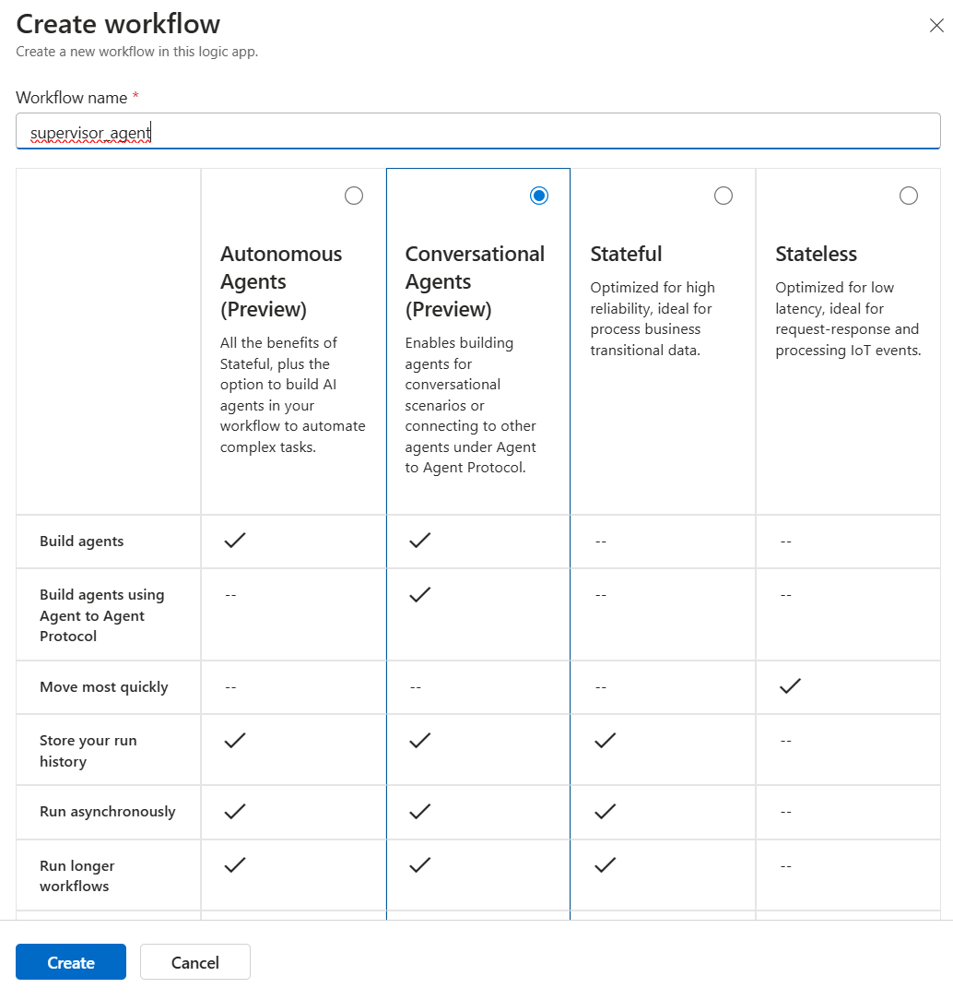
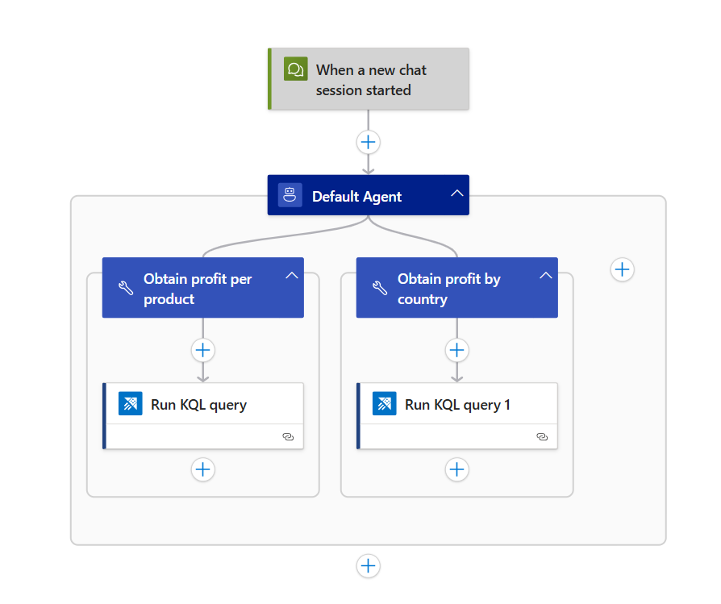
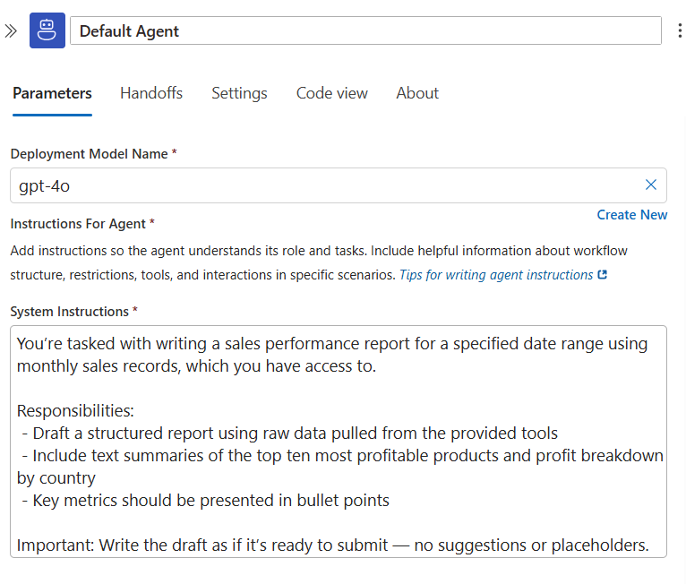
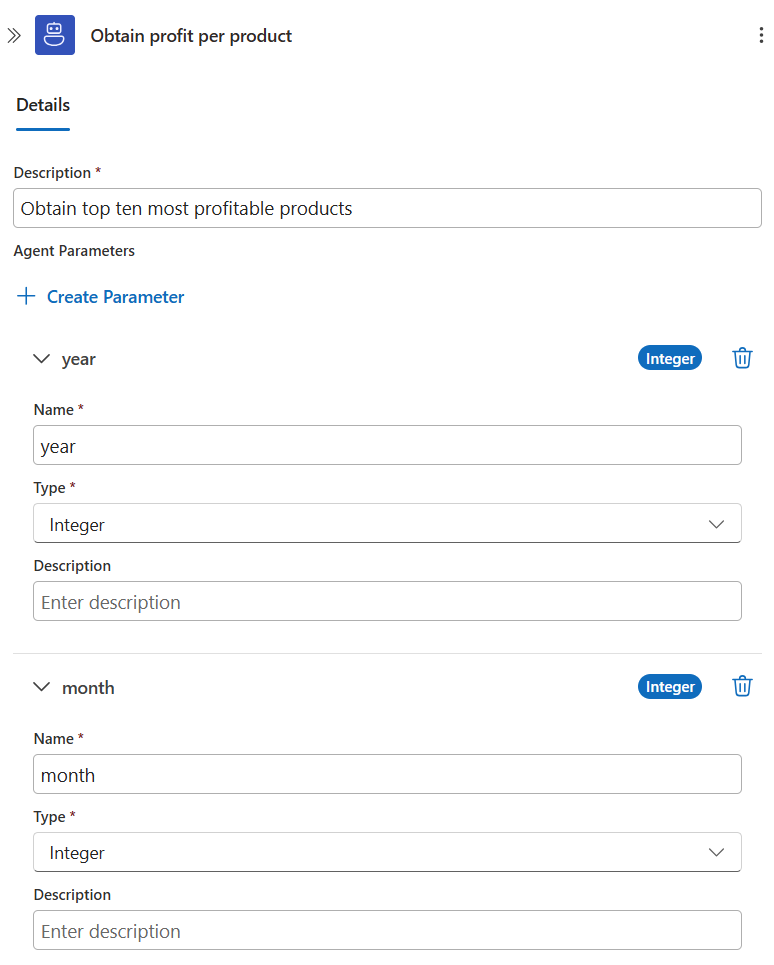
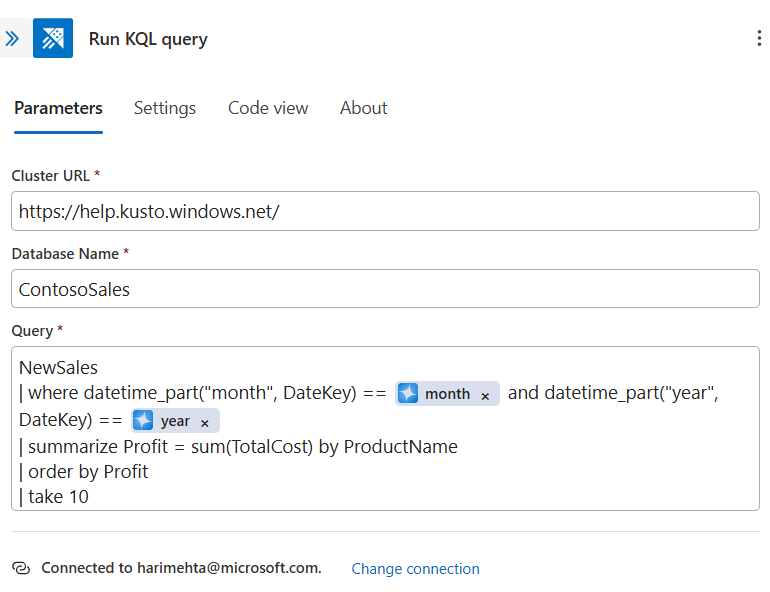
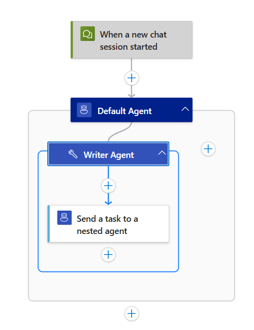
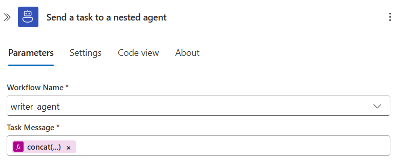
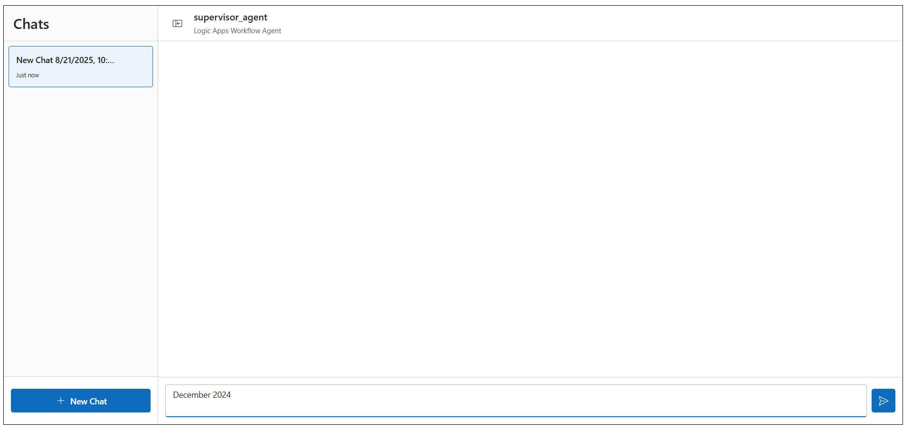
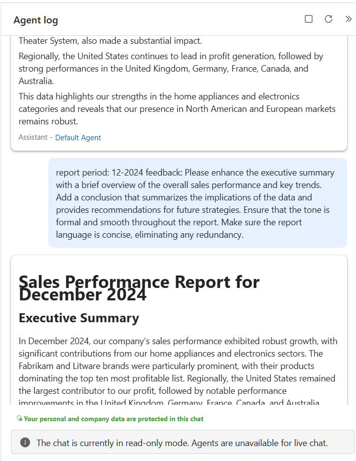

# Module 02 - Use nested agents as tools
In this module, we'll use the Logic Apps Nested Agent action to build a multi-agent system for publishing a monthly sales report. The Nested Agent action leverages the agent-as-tool framework.

## Agent-as-Tool Framework

In a multi-agent system, using the agent-as-tool framework allows one agent to delegate a complex task to another specialized agent. This approach offers several key advantages:

- **Modularity**: Each nested agent focuses on a specific, complex task, making the overall system easier to design and manage
- **Reusability**: You can reuse the same specialized nested agent across different workflows, saving development time and effort
- **Context preservation**: Nested agents can maintain their own conversation history and state, enabling them to produce more nuanced, context-aware outputs

## When to use the Nested Agent action?

Use the Logic Apps Nested Agent action when a supervisor agent needs to delegate a complex subtask that requires a specialized, multi-step process to a child agent. The supervisor remains in control of the overall workflow and integrates the child agent's output to complete the final task.

## What is the difference between Nested Agent and Workflow actions?

Both Nested Agent and Workflow actions invoke a child workflow from a parent workflow. The key difference is that the Workflow action starts a new run each time, losing context and chat history, while the Nested Agent action operates within a single run, preserving context and building on prior interactions.

## Publishing a monthly sales report leveraging Nested Agent Action

1. Create a workflow for the supervisor agent. The workflow can be of kind `Autonomous Agents` or `Conversational Agents`. For this module, we will be using Conversational Agents.

2. Similarly, create a workflow for the writer agent. Since this is the child workflow, it must be of kind `Conversational Agents`.

3. Now, let's navigate to the designer view for the `writer_agent` workflow and begin adding the required components. For reference, a completed example of the workflow is included below.

4. We will first add the appropriate deployment model name and the following system instructions to the default agent.

The prompt is included below for convenience.

<pre>
You’re tasked with writing a sales performance report for a specified date range using monthly sales records, which you have access to.

Responsibilities:
 - Draft a structured report using raw data pulled from the provided tools
 - Include text summaries of the top ten most profitable products and profit breakdown by country
 - Key metrics should be presented in bullet points

Important: Write the draft as if it’s ready to submit - no suggestions or placeholders.
</pre>

5. Then, we will add two Azure Data Explorer actions, `Run KQL query` as two tools to the agent.

6. Click on the first tool and rename it `Obtain profit per product`. Include the following description: `Obtain top ten most profitable products`. Also, add the agent parameters `year` and `month`, both of which are of integer type.

7. Next, click on the second tool and rename it `Obtain profit by country`. Include the following description: `Obtain profit breakdown by country`. Again, add the agent parameters `year` and `month`, both of which are of integer type.

8. Then, click on the `Run KQL query` action and provide credentials to authorize the connection.

Once the credentials are provided, add the cluster url, database name and query.

The cluster url, database name and query are included below for convenience.

Cluster URL: `https://help.kusto.windows.net/`

Database Name: `ContosoSales`

Query:
<pre>
NewSales
| where datetime_part("month", DateKey) == @{agentParameters('month')} and datetime_part("year", DateKey) == @{agentParameters('year')}
| summarize Profit = sum(TotalCost) by ProductName
| order by Profit
| take 10
</pre>

9. Similarly, click on the `Run KQL query 1` action and input the following:

Cluster URL: `https://help.kusto.windows.net/`

Database Name: `ContosoSales`

Query:
<pre>
NewSales
| where datetime_part("month", DateKey) == @{agentParameters('month')} and datetime_part("year", DateKey) == @{agentParameters('year')}
| summarize Profit = sum(TotalCost) by RegionCountryName
| order by Profit
</pre>

10. Let's navigate to the designer view for the `supervisor_agent` workflow and begin adding the required components. For reference, a completed example of the workflow is included below.

11. First add the appropriate deployment model name and the following system instructions to the default agent.

<pre>
You are the Supervisor Agent overseeing the creation of a sales performance report.

1. Use the Writer Agent to draft the report for a given date range.
2. Review the draft to ensure smooth flow, formal tone, and concise language.
3. Provide feedback to the Writer Agent for revisions as needed.
4. Repeat this process until the report is polished and ready for submission.
</pre>

12. Then, add the `Send a task to a nested agent` as a tool to the agent.

13. Click on the tool and rename it `Writer Agent`. Include the following description: `Have the writer agent data gather from enterprise systems and draft a narrative report with business insights and receive the response`.

Then add the following agent parameters:

**1. report_period**
- **Type:** `String`
- **Description:** The requested month and year of report period (ex. 01-2025)

**2. feedback**
- **Type:** `String`

14. In the Nested Agent Action, input the workflow name and the task message.

We will choose `writer_agent` from the dropdown for Workflow Name and input the following task message: `concat('report period: ', agentParameters('report_period'), ' feedback: ', agentParameters('feedback'))`.

15. Click on Chat on the upper left hand corner and type in `December 2024`.

You should be able to see the initial draft review and the revised draft that the supervisor agent provides.

16. Finally, navigate to the run history of the `writer_agent`. You should be able to see that only a single workflow invocation occurs and that context is maintained throughout the conversation.

